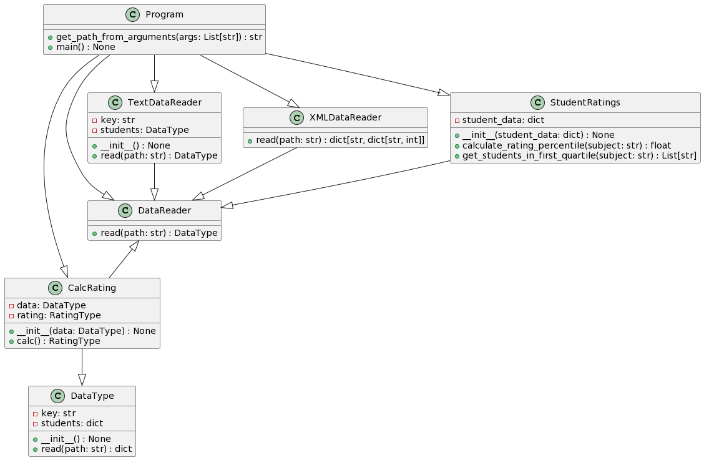

# Лабораторная 1 по дисциплине "Технологии программирования"

## Цели работы

1. Познакомиться с Git и его функциональностью как распределенной системой контроля версий.
2. Понять концепции непрерывной интеграции (CI) и непрерывного развертывания (CD) в современной разработке программного обеспечения.
3. Получить навыки разработки объектно-ориентированных программ на языке программирования Python и написания модульных тестов с использованием библиотеки pytest.
4. Освоить работу с Git для хранения и управления версиями программного обеспечения.
5. Приобрести навыки автоматизированного тестирования программного обеспечения в системе Git с помощью инструмента GitHub Actions.

## Основные положения

В рамках лабораторной работы предоставляется пример проекта, который рассчитывает средний рейтинг студентов по дисциплинам. Список студентов и их оценки хранятся в текстовом файле. Проект разработан на языке программирования Python 3, и для модульного тестирования используется библиотека pytest. Сам проект оформлен в виде директории с именем "rating" и включает в себя следующие компоненты:

- `main.py`: Основной скрипт для вычисления среднего рейтинга студентов.
- `students.txt`: Файл с данными о студентах и их оценках.
- `tests/`: Директория с модульными тестами для проекта.
- `.github/workflows/`: Директория с конфигурацией GitHub Actions для автоматической сборки и тестирования проекта.

## Используемые языки / библиотеки / технологии

- Язык программирования: Python 3
- Библиотека для модульного тестирования: pytest
- Система контроля версий: Git
- Инструмент CI/CD: GitHub Actions

## Индивидуальное задание
- Считать данные в формате XML
- Вывести первый квартиль

## Выводы по работе

После завершения лабораторной работы были получены навыки работы с системой контроля версий Git, разработке программ на языке Python, написании модульных тестов с использованием библиотеки pytest и автоматизации процесса тестирования с помощью GitHub Actions. Такие навыки являются важными для современных разработчиков программного обеспечения и способствуют более эффективной и надежной разработке проектов.

## UML диаграмма

